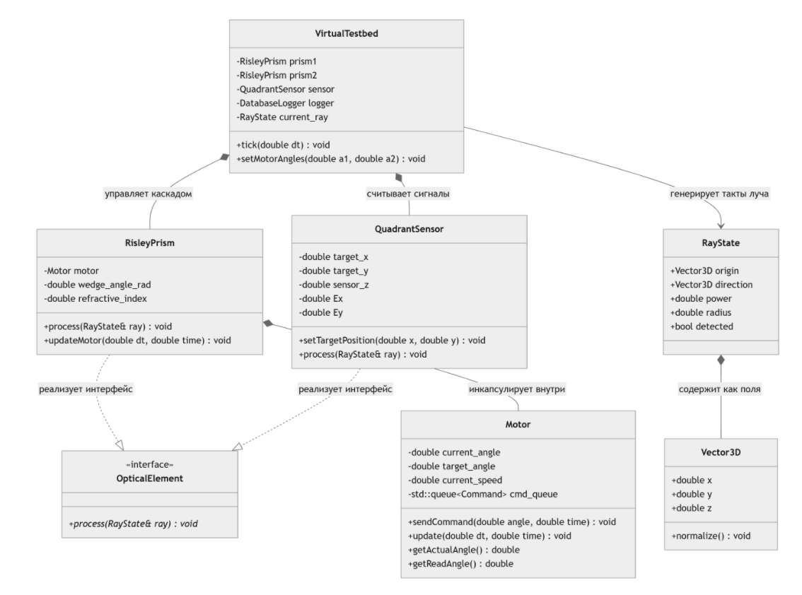

# Оптико-механическая система для выравнивания луча

## 1. Общая логическая картина работы программы

Программа представляет собой замкнутый цифровой симулятор следящей оптико-механической системы наведения. Такие комплексы используются для прецизионного управления направлением лазерного луча. Наведение осуществляется с помощью двух вращающихся клиновых призм Рисли, установленных последовательно на пути следования оптического излучения. Поворачивая призмы друг относительно друга, можно отклонять луч в конкретную точку пространства.

Работа симулятора организована в виде тактового итерационного процесса с шагом по времени dt = 0.01 с. На каждом такте выполняются следующие последовательные этапы:
1. **Генерация воздействий среды:** Активный сценарий испытаний вычисляет новые пространственные координаты движущейся мишени и добавляет случайное угловое дрожание (джиттер) к входному вектору лазерного луча.
2. **Оптический тракт (Прямая задача оптики):** Лазерный луч последовательно проходит сквозь первую призму, затем сквозь вторую призму, преломляясь на четырех оптических границах раздела сред «воздух-стекло» в трехмерном пространстве согласно закону Снеллиуса. На датчике вычисляется точка падения луча и определяются аналоговые сигналы рассогласования (ошибки наведения по осям X и Y).
3. **Контур обратной связи (САР):** Система автоматического регулирования считывает сигналы ошибок с датчика. Если луч находится на датчике, система методом малых возмущений численно рассчитывает матрицу Якоби (Якобиан) и вычисляет корректирующие углы поворота для приводов. Если луч утерян и система ослепла, САР переходит в режим аварийного розеточного поиска по фигурам Лиссажу.
4. **Физика исполнительных механизмов:** Команды управления передаются электроприводам. Модели моторов рассчитывают динамику разгона и торможения с учетом ограничений крутящего момента, геометрической массы, моментов инерции призм и алюминиевых оправ, а также воспроизводят шумы датчиков положения и задержку прохождения сигнала по кабелю цифровой шины.
5. **Логирование и Пост-анализ:** Текущие углы приводов, сигналы ошибок и статус попадания на каждом шаге времени сохраняются в реляционную базу данных SQLite. После завершения прогона симуляции программа закрывает файлы записи, переоткрывает базу данных и рассчитывает итоговые критерии эффективности САР (KPI).

---

## 2. Спецификация классов, структур и методов

### Файлы: ray_state.h и optical_element.h

#### Структура Vector3D
* **Описание концепции:** Математическое описание трехмерного направленного отрезка (вектора) в пространстве, имеющего координаты по трем осям. Используется для представления пространственного положения луча и нормалей к поверхностям стекол.
* **Спецификация обозначений:**
    * `x`, `y`, `z` - вещественные координаты вектора в пространстве.
    * `normalize()` - метод приведения вектора к единичной длине путем деления каждой координаты на общую евклидову длину, вычисляемую через функцию квадратного корня `std::sqrt(x * x + y * y + z * z)`.

#### Структура RayState
* **Описание концепции:** Полный физический паспорт лазерного луча в текущий момент времени. Содержит информацию о том, откуда он светит, куда направлен и какими оптическими свойствами обладает.
* **Спецификация обозначений:**
    * `origin` - пространственная точка зарождения луча (тип `Vector3D`).
    * `direction` - единичный вектор направления распространения луча (тип `Vector3D`).
    * `power` - остаточная оптическая мощность луча (изначально равна `1.0`).
    * `radius` - физический радиус лазерного пучка (необходим для корректной работы датчика).
    * `detected` - бинарный флаг успешного удержания/обнаружения луча элементом.
    * `RayState()` - конструктор, инициализирующий луч из точки (0,0,0) строго вдоль продольной оптической оси Z (0,0,1).

#### Класс OpticalElement
* **Описание концепции:** Абстрактное общее правило (интерфейс) для любого физического объекта, который устанавливается на оптической скамье и способен как-либо взаимодействовать с проходящим лазерным лучом.
* **Спецификация обозначений:**
    * `process(RayState& ray)` - чистый виртуальный метод. Обязывает всех наследников принять по ссылке объект лазерного луча и необратимо изменить его параметры (направление или мощность) согласно своей физической природе.

---

### Файл: test_scenario.h

#### Класс TestScenario
* **Описание концепции:** Абстрактный шаблон для проектирования программных испытаний. Позволяет задавать законы изменения внешней среды независимо от физики самой оптической системы.
* **Спецификация обозначений:**
    * `apply(...)` - чистый виртуальный интерфейсный метод изменения параметров внешней среды (времени, направления луча, координат цели и джиттера).

#### Класс SpeedTestScenario
* **Описание концепции:** Реализация теста на ступенчатое изменение положения цели. Моделирует ситуацию, когда мишень мгновенно совершает прыжок в сторону, позволяя оценить скорость и динамику наведения САР.
* **Спецификация обозначений:**
    * `apply(...)` - фиксирует входной луч строго вдоль оптической оси, смещает цель на 3 мм по X и на 2 мм по Y (`target_x = 3.0; target_y = 2.0;`), задавая минимальный фоновый шум лазера.

#### Класс StressTestScenario
* **Описание концепции:** Жесткий стресс-тест, в котором мишень стоит неподвижно в центре, но сам лазер скачкообразно меняет угол своего входного наклона каждые 2 секунды симуляции.
* **Спецификация обозначений:**
    * `apply(...)` - проверяет время и переключает угол падения луча по ряду значений (80° -> 15° -> 45° -> 5°), рассчитывая новый вектор направления через функции `std::sin` и `std::cos`.

#### Класс VariableJitterScenario
* **Описание концепции:** Сценарий испытания системы на устойчивость к интенсивным внешним вибрациям лазерной платформы (джиттеру). Мишень зафиксирована строго в центре.
* **Спецификация обозначений:**
    * `custom_jitter` - внутреннее приватное поле, хранящее заданный угол вибрации в радианах.
    * `apply(...)` - удерживает координаты цели в нулевой точке (`0,0`), транслируя накопленный угловой шум в систему через переменную `jitter_sigma`.

---

### Файл: motor.h

#### Структура Command
* **Описание концепции:** Цифровая посылка (команда), отправляемая управляющим компьютером в контроллер двигателя. Содержит целевую позицию и временную метку, когда эта команда должна быть исполнена.
* **Спецификация обозначений:**
    * `target_angle` - целевой угол поворота вала мотора.
    * `execution_time` - время исполнения команды с учетом времени задержки распространения сигнала по кабелю.

#### Класс Motor
* **Описание концепции:** Математическая модель реального электропривода. Рассчитывает динамику разгона и торможения с учетом ограничений крутящего момента, геометрической массы деталей, а также воспроизводит транспортные задержки шины и шумы энкодеров.
* **Спецификация обозначений:**
    * `current_angle`, `target_angle`, `current_speed` - внутренние переменные текущего углового состояния привода.
    * `max_speed`, `acceleration`, `signal_delay`, `noise_amplitude` - паспортные физические ограничения и параметры привода.
    * `cmd_queue` - временной буфер (очередь команд `std::queue<Command>`), моделирующий задержку кабеля.
    * `setHardwareParams(...)` - ручная конфигурация параметров привода без учета геометрии.
    * `setInertiaConfig(...)` - физический калькулятор инерции. Принимает радиусы и толщину стекла призмы, размеры алюминиевой оправы, плотности материалов, находит их массы и моменты инерции по формулам теормеханики и вычисляет честное предельное ускорение вала: `acceleration = момент_мотора / суммарный_момент_инерции`.
    * `sendCommand(double angle, double current_time)` - добавляет команду в очередь с меткой времени `current_time + signal_delay`.
    * `update(double dt, double current_time)` - динамический просчет состояния. Извлекает долетевшие команды, вычисляет рассогласование, изменяет скорость с учетом ускорения, ограничивает её через `std::clamp` и сдвигает реальный угол `current_angle`.
    * `getActualAngle()` - возвращает чистый физический угол вала.
    * `getReadAngle()` - имитирует работу зашумленного энкодера, возвращая `current_angle + случайный_шум * noise_amplitude`.
    * `getAngleRadians()` - переводит текущий физический угол в радианы для оптических расчетов.

---

### Файл: risley_prism.h

#### Класс RisleyPrism
* **Описание концепции:** Вращающийся стеклянный оптический клин. Перехватывает луч и отклоняет его вектор направления в 3D-пространстве в зависимости от угла поворота своего мотора и погрешностей сборки.
* **Спецификация обозначений:**
    * `motor` - индивидуальный встроенный электропривод (объект класса `Motor`), вращающий данную призму.
    * `wedge_angle_rad`, `refractive_index` - геометрический угол клина призмы и показатель преломления её стекла.
    * `tilt_error_x`, `tilt_error_y` - паразитные углы перекоса призмы при производстве (в радианах).
    * `refract(...)` - приватный метод расчета 3D-преломления луча на границе сред по векторному закону Снеллиуса. Дополнительно рассчитывает коэффициенты отражения Френеля, уменьшая остаточную мощность луча.
    * `updateMotor(...)`, `sendMotorCommand(...)`, `getMotorReadAngle()` - методы-делегаты, пробрасывающие управление напрямую во внутренний объект `motor`.
    * `setPrismInertiaHardware(...)` - метод-делегат, передающий геометрические размеры деталей в калькулятор инерции мотора.
    * `process(RayState& ray)` - основной метод. Запрашивает угол мотора, вычисляет пространственные векторы нормалей к двум граням стекла (с учетом перекосов) и дважды вызывает метод `refract` (на входе в стекло и на выходе из него), изменяя вектор направления луча `ray.direction`.

---

### Файл: quadrant_sensor.h

#### Класс QuadrantSensor
* **Описание концепции:** Приемная мишень (четырехсекторный фотодиод). Находит точку пересечения лазерного луча со своей поверхностью, интегрирует энергию лазерного пятна по четырем квадрантам и выдает аналоговые сигналы промаха по осям X и Y.
* **Спецификация обозначений:**
    * `target_x`, `target_y` - координаты центра мишени на датчике, задаваемые внешним сценарием.
    * `sensor_z` - фиксированное продольное положение плоскости датчика на оптической скамье.
    * `Ex`, `Ey` - аналоговые сигналы рассогласования в диапазоне [-1.0; 1.0].
    * `setTargetPosition(x, y)` - смещает координаты мишени вслед за сценарием тестов.
    * `process(RayState& ray)` - аналитически находит точку пересечения трехмерной линии луча с плоскостью `sensor_z`. Вычисляет относительный промах `dx` и `dy`. Рассчитывает аналоговые сигналы `Ex` и `Ey` через интегральную функцию ошибок `std::erf(dx / ray.radius)`. Если луч полностью промахивается мимо датчика, значения уходят в насыщение (±1.0), а флаг попадания `ray.detected` сбрасывается.

---

### Файлы: database_logger.h и database_logger.cpp

#### Класс DatabaseLogger
* **Описание концепции:** Бортовой самописец («черный ящик») и аналитический модуль системы. На каждом шаге сохраняет параметры симуляции в базу данных SQLite, а при завершении работы - рассчитывает итоговые оценки качества САР.
* **Спецификация обозначений:**
    * `db` - дескриптор открытой сессии файла базы данных (тип `sqlite3*`).
    * `DatabaseLogger()` - конструктор, создает на диске файл `telemetry.db` и инициализирует таблицу `Logs`.
    * `logStep(...)` - формирует и выполняет команду `INSERT INTO Logs`, мгновенно записывая текущие углы приводов, сигналы ошибок и флаг попадания на жесткий диск.
    * `printFinalKPI()` - модуль пост-анализа. Принудительно переоткрывает базу данных для сброса кэша записи. Через `sqlite3_prepare_v2` компилирует SQL-запрос выборки истории шагов. Вычисляет время первого стабильного захвата мишени (`Settling Time`), процент удержания луча (`Lock Ratio`) и среднеквадратичное отклонение промаха (`RMS Error`), выводя готовый аналитический паспорт испытаний в консоль.

---

### Файлы: virtual_testbed.h и virtual_testbed.cpp

#### Класс VirtualTestbed
* **Описание концепции:** Центральный симулятор и агрегатор всего проекта. Соединяет в единую цепь элементы, продвигает глобальное время вперед на шаг dt и замыкает контур обратной связи САР.
* **Спецификация обозначений:**
    * `prism1`, `prism2`, `sensor`, `logger`, `current_ray` - инкапсулированные компоненты оптического стенда.
    * `global_time` - счетчик текущего модельного времени симуляции.
    * `active_scenario` - умный указатель (`std::shared_ptr<TestScenario>`) на текущую стратегию (сценарий) испытаний.
    * `setupInertiaHardware(...)` - метод конфигурации физических и геометрических параметров приводных узлов.
    * `updateControlLoop()` - логика САР. Считывает ошибки с датчика. Если контур ослеп ($|E| \ge 0.99$), включает аварийный режим **Search Mode** (сканирование пространства по фигурам Лиссажу). Если луч пойман, методом малых возмущений численно вычисляет матрицу Якоби, инвертирует её и выдает корректирующие команды на приводы.
    * `tick(double dt)` - шаг симуляции. Объединяет в единый конвейер опрос сценария, джиттер лазера, физику приводов, трассировку оптики и сохранение шага в логгер.

---

### Файл: main.cpp

* **Описание концепции:** Главный управляющий модуль, выполняющий роль испытательного полигона. Поочередно конфигурирует и запускает три различных сессии тестирования, выводя результаты на экран.
* **Спецификация обозначений:**
    * `runSimulationSession(...)` - функция прогона одной сессии. Конструирует стенд, задает параметры инерции деталей, 300 раз вызывает метод `tick(0.01)` (3 секунды работы прибора) и вызывает метод `exportLogs()` для генерации KPI-отчета.
    * `main()` - точка входа. Поочередно запускает сессию №1 (легкая оптика), сессию №2 (тяжелая инерционная оптика), затем контур для сессии №3 (вибрации и джиттер лазера под углом 0.5°), генерируя паспорта аналитики.

## 3. Заготовки на будущее

### Интерфейсный слой Qt
* **Графическая оболочка приложения:** Перенос расчетного ядра в полноценный оконный цикл `QApplication` на базе `QMainWindow`.
* **Визуализация переходных процессов (QCustomPlot):** Реализация графического вывода телеметрии напрямую из базы данных SQLite в реальном времени. Планируется отрисовка 2D-траектории луча на датчике (пространственный портрет), графиков ошибок Ex/Ey и хронограммы статуса фиксации цели.
* **Интерактивный пульт управления (Панель конфигурации):** Добавление графических элементов ввода (`QDoubleSpinBox`, `QComboBox`) для оперативного изменения геометрии призм, крутящего момента моторов, задержек шины и выбора пресетов тестирования.
* **Интеграция кастомных воздействий:** Возможность ручного ввода координат для мгновенного ступенчатого прыжка мишени прямо во время симуляции для проверки динамической устойчивости САР.

### Этап Б: Модернизация физического ядра 
* **Интерактивная настройка контура управления:** Вынос коэффициентов ПИД-регулятора на панель интерфейса для ручной или автоматической параметрической оптимизации контура наведения.
* **Усложнение геометрии оптического тракта:** Внедрение учета воздушных зазоров (расстояний) между последовательно установленными призмами и динамического изменения дистанции до плоскости фотоприемника.
* **Масштабирование оптической системы (P-призмы)**
* **Режим генерации технологических узоров:** Добавление модуля скоординированного управления скоростями приводов для рисования лазером сложных траекторий (розеток, спиралей, гипоциклоид) в задачах лазерной гравировки и маркировки материалов.
* **Модуль решения обратной задачи (Inverse Problem Solver):** Разработка математического блока на базе алгоритмов глобальной оптимизации для автоматического распознавания и восстановления физических параметров оптического тракта (углов, скоростей, параметров стекла) по готовому рисунку траектории луча.